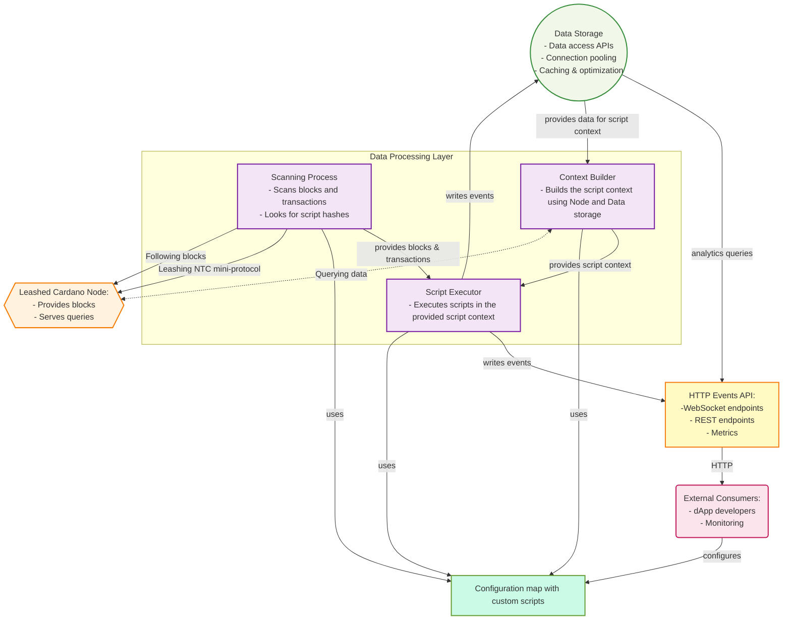
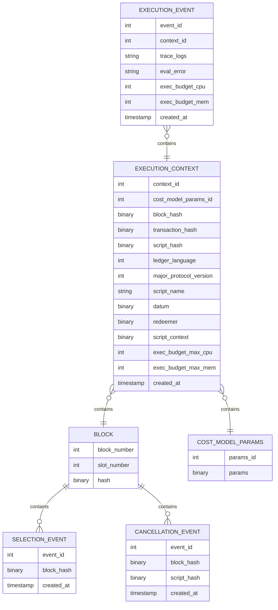

# Plutus Script Re-Executor Specification

* [Abstract](#abstract)
* [Architecture Overview](#architecture-overview)
* [Glossary](#glossary)
* [Component Specifications](#component-specifications)
    * [Scanning Process](#1-scanning-process)
    * [Context Builder](#2-context-builder)
    * [Script Executor](#3-script-executor)
    * [Events API](#4-events-api)
    * [Full Cardano Node Integration](#5-full-cardano-node-integration)
    * [Leash Node-to-Client protocol](#6-leash-node-to-client-protocol)
    * [Configuration Map](#7-configuration-map)
    * [Data Storage](#8-data-storage)
* [References](#references)

## Abstract

This document proposes an architecture for "Plutus Script Re-Executor" — a tool for Cardano dapps developers to run custom PlutusCore scripts while following the node in parallel to the original scripts.

This is up-to-date document. The history of decisions that influenced the specification should be available in [ADRs](adr/)

### Architecture Overview

The Plutus Script Re-Executor system consists of main components:

1. **Scanning Process** — process that connects to Cardano node and follows it, scanning the blocks
2. **Context builder** — instrument that provides `ScriptContext` for a given `ScriptHash` 
3. **Script executor** — tool to run custom `PlutusCore` scripts using the provided `ScriptContext` 
4. **Events API** — REST endpoints with access to the results of the re-executor
5. **Full Cardano Node** — standard node providing blocks, validation services and canonical chain state
6. **Leash Node-to-Client protocol** — mini-protocol & connection mode to limit the node's eagerness
7. **Configuration map** — user configuration parser
8. **Data storage** — file for unstructured logs or database to keep the data in a structured manner



The dApp developer will run the Plutus Script Re-Executor (PSR) that connects to the Cardano Node using leashing connection mode. The scanning process will follow the node to scan the blocks and transactions for ScriptHashes specified in the configuration map. Each script that has a `ScriptHash` mentioned in the configuration map, will be re-executed by the PSR reusing/rebuilding the same ScriptContext and the results of the execution will be saved in data storage (optional). The events emitted by the PSR are available via WebSocket chanel and, if data storage is enabled, via HTTP Events Api with a metrics endpoint to monitor the status of the application. 

### Glossary

- `ScriptHash` — Type representing the /BLAKE2b-224/ hash of a script. 28 bytes.
- `ScriptContext` — An input to a Plutus script created by the ledger. It includes details of the transaction being validated. Additionally, since a transaction may do multiple things, each of which needs to be validated by a separate script, the script context also specifies what exactly the current script is responsible for validating. 
- `PlutusCore` — a low-level language for on-chain code, based on untyped lambda calculus.
- `Mini-protocol` — a mini protocol is a well-defined and modular building block of the network protocol. Structuring a protocol around mini-protocols helps manage the overall complexity of the design and adds useful flexibility.
- `Leashing` — by "leashing" we mean setting the point`leashing_point` in the node such that the node won't process blocks after `leashing_point + k`.

More here https://plutus.cardano.intersectmbo.org/docs/glossary

### Component Specifications

#### 1. Scanning Process

**Purpose**: follows the node and scans for specified `ScriptHash` scripts using Chain-Sync Node-to-Client mini-protocol.

**Configuration**: takes a list of `ScriptHash` entities from the configuration map.

#### 2. Context Builder

**Purpose**: to be able to run a script we need to rebuild its context on-chain, this component either provides it from the data storage or queries from the node using Local State Query Node-to-Client mini-protocol.

#### 3. Script Executor

**Purpose**: run the provided `PlutusCore` script in the given `ScriptContext` using the configuration map.

**Configuration**:
- There might be `n` processes to execute scripts in parallel. (optional)
- Timeout in milliseconds to limit the execution time. (optional)

**Details**: the executor takes the configuration map and each time it sees a known `ScriptHash` in the transaction, it executed the corresponding script from the map. 

#### 4. Events API

**Purpose**: provides access to the results of the scripts re-executing. Note, that `GET` endpoints provide data only if the SQLite database is enabled. Only the WebSocket endpoints streams the data in real time.

**Architecture**: HTTP API that queries data from the data storage and returns JSON responses. Also provides OpenAPI spec. 

**Types of events**:

- **Execution**: identifies each re-execution and includes its observed trace messages.
- **Selection**: identifies when each time the local node updates its selection, including the slot number, block number, and header hash, which is sufficient information for the dapp developer to estimate of the on-going settlement probability for each script execution, according to standard Cardano settlement tables.
- **Cancellation**: identifies which script executions were undone whenever the local node switches away from the blocks that executed some scripts in the configuration data.

**Endpoints**:

##### WebSocket endpoints /events-ws and /events-ws/{ script_hash | name or alias }

Streams events in JSON format. Also supports the query parameters, allowing to filter out the irrelevant events. 

**Query Parameters**:
- `type`: `execution`, `selection`, or `cancellation` (optional)
- `time_begin`: ISO 8601 time range begin (optional)
- `time_end`: ISO 8601 time range end (optional)
- `slot_begin`: Slot number range begin (optional)
- `slot_end`: Slot number range end (optional)

##### GET /events/

Returns all events with filtering.

**Query Parameters**:
- `type`: `execution`, `selection`, or `cancellation` (optional)
- `time_begin`: ISO 8601 time range begin (optional)
- `time_end`: ISO 8601 time range end (optional)
- `slot_begin`: Slot number range begin (optional)
- `slot_end`: Slot number range end (optional)
- `limit`: Results per page (default: 50, max: 1000)
- `offset`: Pagination offset (default: 0)

**Response**: JSON array of all relevant events with basic metadata (block hash, slot, timestamp).

##### GET /events/{ script_hash | name or alias }

Returns all events relevant to the provided `script_hash` or `name` with filtering.

**Query Parameters**:
- `type`: `execution`, `selection`, or `cancellation` (optional)
- `time_begin`: ISO 8601 time range begin (optional)
- `time_end`: ISO 8601 time range end (optional)
- `slot_begin`: Slot number range begin (optional)
- `slot_end`: Slot number range end (optional)
- `limit`: Results per page (default: 50, max: 1000)
- `offset`: Pagination offset (default: 0)

**Response**: JSON array of all events relevant to the provided `script_hash` with basic metadata (block hash, slot, timestamp).

##### GET /execute/{ script_hash | name or alias }

Executes the provided hash in the latest execution context (latest here means ordered by `created_at`) if no parameters are provided.

**Query Parameters**:
- `context_id`: executes script in the provided execution context
- `tx_id`: executes script in the provided transaction hash

**Response**: JSON array of the execution events relevant to the provided `script_hash` with basic metadata (block hash, slot, timestamp).

##### GET /metrics

Prometheus metrics endpoint exposing operational statistics in standard exposition format.

**Key Metrics**:
- Scanning: blocks/transactions scanned, scripts per block/transaction
- Processing: operation durations, unprocessed data backlog, database operations
    - Average block processing time
    - Average script execution time
- Storage: database size by table, evictions, storage limit hits
- System Health: active processes, service availability, resources consumption

#### 5. Full Cardano Node Integration

**Purpose**: Provide data for the scanning process. 

**Responsibilities**:

- **Validation Service**: Provides Node-to-Client queries for background workers to classify collected data
- **Canonical Chain State**: Maintains full ledger state to identify which blocks are on the canonical chain

**Configuration**:

- Standard cardano-node with normal network connectivity
- Maintains full ledger state for validation queries

#### 6. Leash Node-to-Client Protocol

**Purpose**: a Node-to-Client protocol that allows to "leash" the node and keep the resource usage under control by preventing its internal ledger advancing too quickly.

If the re-executor is too slow to process the events, it can "leash" the node to pause the block processing, slowing down and allowing for the re-executor to catch up.

**Details**: 

1. We want to leash the node when we see a relevant block with transactions that include `ScriptHash`es we are interested in.
2. We want to make sure that we don't fall behind and don't see such a block too late (more than 12 hrs for example).
3. We want to be able to communicate the leashing point to the node via Node-to-Client mini-protocol.
4. The leashing point — is a point on chain such that the node would never progress more than 2160 blocks past that point.
5. The node should recognize the message and pause progressing — getting the blocks from other nodes and changing the ledger state.
6. We want to be able to query the ledger state from the node via Node-to-Client mini-protocol while the node is paused and the ledger state is immutable.
7. We want to be able to communicate the new leashing point message to the node via Node-to-Client mini-protocol.
8. The node should recognize this new message and update the leashing point which will allow node to resume getting the blocks from other nodes.
9. The manipulations on the leashing point should be atomic operations.

**Node-to-Client mini-protocol**:

The step (3) can be done by either extending the existing `Local State Query` mini-protocol or introducing a new one, that will be very similar.

In this specification we consider re-using the existing `Local State Query` mini-protocol to speed-up the development. It will be easy to create a separate mini-protocol after the MVP will be finished and the correct approach should be chosen and approved by the cardano-node developers.

Here is the CDDL of the `LocalStateQuery`:

```
;
; LocalStateQuery mini-protocol.
;

localStateQueryMessage
  = msgAcquire
  / msgAcquired
  / msgFailure
  / msgQuery
  / msgResult
  / msgRelease
  / msgReAcquire
  / lsqMsgDone

acquireFailurePointTooOld     = 0
acquireFailurePointNotOnChain = 1

failure      = acquireFailurePointTooOld
             / acquireFailurePointNotOnChain

query        = any
result       = any

msgAcquire   = [0, base.point]
             / [8]
             / [10]
msgAcquired  = [1]
msgFailure   = [2, failure]
msgQuery     = [3, query]
msgResult    = [4, result]
msgRelease   = [5]
msgReAcquire = [6, base.point]
             / [9]
             / [11]
lsqMsgDone   = [7]

;# import network.base as base
```

and the relevant code implementation https://github.com/IntersectMBO/ouroboros-network/blob/main/ouroboros-network/protocols/lib/Ouroboros/Network/Protocol/LocalStateQuery/Codec.hs#L78

The CDDL could be extended in the following ways:

1. Adding new reasons of failures: 

```
acquireFailurePointTooOld     = 0
acquireFailurePointNotOnChain = 1
acquireFailureStateIsBusy     = 2

failure      = acquireFailurePointTooOld
             / acquireFailurePointNotOnChain
             / acquireFailureStateIsBusy
```

2. Either by adding a boolean flag to the existing `msgAcquire` messages:

```
   = [0, base.point, ? bool]
             / [8, ? bool]
             / [10, ? bool]
```

or by adding new "leashed" versions:

```
msgAcquire   = [0, base.point]
             / [8]
             / [10]
             / [12, base.point] ; leashed `MsgAcquire` of `SpecificPoint pt`
             / [13] ; leashed `MsgAcquire` of `VolatileTip`
             / [14] ; leashed `MsgAcquire` of `ImmutableTip`
```

`msgReAcquire` will behave depending on which version of `msgAcquire` was sent.

**Cardano node changes**:

The step (5) should introduce the relevant changes to the `cardano-node`.

We want to stop the node from extending its chosen chain while the plutus-script-reexecutor is executing substitute scripts, so that the ledger state can be queried. We list the potential implementation strategies that we considered.

**Strategy 1**:

This could be done pausing the `Block fetch` client that gets blocks from candidate chains.

There is `FetchClientStateVars` ADT, https://github.com/IntersectMBO/ouroboros-network/blob/main/ouroboros-network/lib/Ouroboros/Network/BlockFetch/ClientState.hs#L97, which we can extend with a new state `fetchClientPausedVar` (`False` by default) or add a new status to `PeerFetchStatus` called `PeerFetchStatusPaused`.

If the node receives `msgLeashedAcquire` message, it sets the `PeerFetchStatus` to `PeerFetchStatusPaused` or `fetchClientPausedVar` to `True`.

If the `fetchClientPausedVar` is `True` or `PeerFetchStatus` is `PeerFetchStatusPaused` the `FetchClient` stops any communication. 

When the node receives `msgRelease`, the `fetchClientCtxPaused` is set to `False` or `PeerFetchStatus` switchs to `PeerFetchStatusReady`. 

**Strategy 2**:

We can stop the communication by removing all peers and by pausing adding new ones.

**Configuration**: we might use a similar limit as the limit of eagerness (2,160) to control the window of blocks accessible to the node on leash. 

**Strategy 3**:

The cardano-node already uses the "Limit on Eagerness" mechanism to limit itself in pursuing new blocks:

>The LoE prevents the syncing node from selecting a block that is more than Kcp ahead of the LoE anchor, the intersection of all current peers' header chains.

https://ouroboros-consensus.cardano.intersectmbo.org/docs/references/miscellaneous/genesis_design/#the-limit-on-eagerness-component

We can implement leashing there utilising the existing LoE component.

**Sum up**: the first two strategies seem to be too invasive and we are investigating the third strategy to implement the leashing.

#### 7. Configuration Map

**Purpose**: allows to user to specify which scripts should be executed under specified `script_hash`. 

**Format**:

Each script is specified by:
- Script hash
- Name/alias (optional)
- Either CborHex or file path or plain text uplc

**Configuration**: we are planning to use yaml as a default format for the configuration map. Other formats could be supported later.

**Example**:

```yaml
scripts:
  - script_hash: 921169a988ba72ffd6e9c269cadb3b53b5f360ff99f112d9b2ee30c4d74ad88b
    cbor_hex: 73475cb40a568e8da8a045ced110137e159f890ac4da883b6b17dc651b3a804973475cb40a568e8da8a045ced110137e159f890ac4da883b6b17dc651b3a804973475cb40a568e8da8a045ced110137e159f890ac4da883b6b17dc651b3a804973475cb40a568e8da8a045ced110137e159f890ac4da883b6b17dc651b3a8049

  - script_hash: 622229a988ba72ffd6e9c269cadb3b53b5f360ff99f112d9b2ee30c4d74ad88b
    name: my_script
    path: my_custom_script.json

  - script_hash: 777729a988ba72ffd6e9c269cadb3b53b5f360ff99f112d9b2ee30c4d74ad88b
    plain_uplc: |
       (program 0.1.0 (con integer 42)) 

```

where `my_custom_script.json`:

```json
{
    "type": "PlutusScriptV1",
    "description": "",
    "cborHex": "585e585c01000033322232323233223232322223335300c333500b00a0033004120012009235007009008230024830af38f1ab664908dd3800891a8021a9801000a4c24002400224c44666ae54cdd70010008030028900089100109100090009"
}
```

#### 8. Data Storage

**Purpose**: storage of the emitted events for Events API and future analysis. 

**Motivation**: we want to provide an option to store the results of the scripts execution for future analysis. We provide two options: an unstructured logging to a file and a structured storage using a SQLite database with the entities described below.

**Eviction policies**: at the moment no eviction is performed by the system, but can be written manually by the user. In the future we may provide mechanisms for automatically evicting previous events (`h` hours, `d` days, etc).

**Entities**:

Block:
- `block_number`: Block number
- `hash`: Header hash 
- `slot`: Slot number 

Execution context:
- `context_id`: Id of the context
- `block_hash`: Block header hash
- `cost_model_params_id`: Id of the cost model params 
- `transaction_hash`: Transaction id 
- `script_hash`: Script hash
- `script_name`: Name of the script (optional)
- `ledger_language`: The version the plutus ledger language
- `major_protocol_version`: Major protocol version
- `datum`: Datum of the script (optional)
- `redeemer`: Redeemer of the script (optional),
- `script_context`: Script context 
- `exec_budget_max_cpu`: Max budget cpu
- `exec_budget_max_mem`: Max budget mem
- `created_at`: Timestamp

Cost model params:
- `params_id`: Id of params
- `params`: Parameters

Execution event:
- `event_id`: Id of the event
- `context_id`: Id of the execution event 
- `trace_logs`: Trace of the execution 
- `exec_budget_cpu`: Consumed budget cpu
- `exec_budget_mem`: Consumed budget mem
- `eval_error`: Evaluation error (optional)
- `created_at`: Timestamp

Cancellation event:
- `event_id`: Id of the event
- `block_hash`: Block header hash 
- `script_hash`: Script hash that was cancelled
- `created_at`: Timestamp

Selection event:
- `event_id`: Id of the event
- `block_hash`: Block header hash 
- `created_at`: Timestamp

**Schema**:



### References:

- https://ouroboros-network.cardano.intersectmbo.org/pdfs/network-spec/network-spec.pdf
- https://ouroboros-consensus.cardano.intersectmbo.org/docs/references/miscellaneous/genesis_design/

